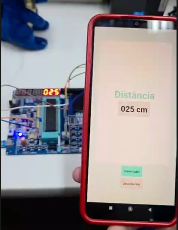
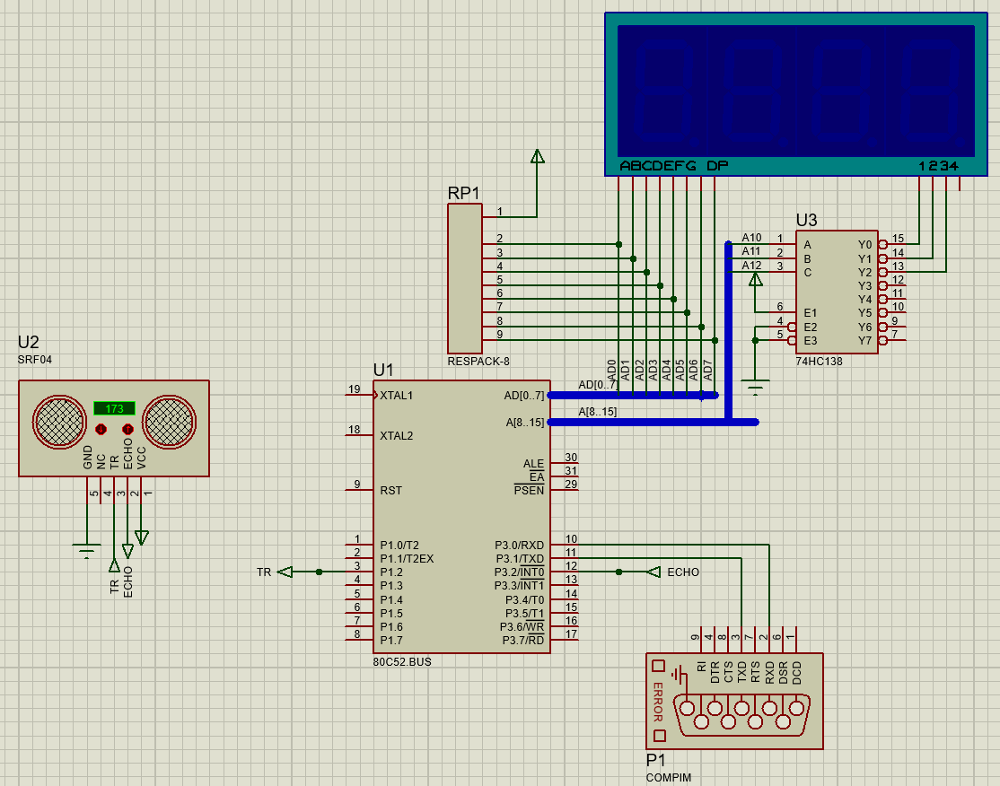

# Medidor de Distância com Ultrassom e Bluetooth (8051)

Este repositório contém o código-fonte, os arquivos de simulação e o aplicativo para um medidor de distância baseado no microcontrolador da família 8051. 
O sistema realiza a leitura de distância através de um sensor ultrassônico, exibe o resultado em tempo real em um display de 7 segmentos nativo da placa e transmite os dados via Bluetooth para um aplicativo Android.

## Hardware Utilizado

O projeto foi desenvolvido com base em uma placa de desenvolvimento 8051, integrando módulos externos para sensoriamento e comunicação:

* **Microcontrolador:** STC89C52RC
* **Sensor de Distância:** Módulo Ultrassônico HC-SR04
* **Comunicação Sem Fio:** Módulo Bluetooth HC-05
* **Interface Visual:** Display de 7 Segmentos (integrado na placa)

## Mapeamento de Pinos

As conexões foram estabelecidas utilizando portas específicas da CPU STC89C52RC:

* **Display de 7 Segmentos:** Controlado via barramentos **P0** e **P2** (para envio dos dados e multiplexação/seleção dos dígitos).
* **Módulo HC-SR04:**
    * **P1.2:** Trigger
    * **P3.2:** Echo.
* **Módulo HC-05:**
    * **RXD / TXD:** Conectados aos pinos seriais nativos da placa para comunicação UART com o aplicativo.

## Tecnologias utilizadas

* **Linguagem:** Assembly (80C51)
* **Simulação:** Proteus
* **Aplicativo Mobile:** Android

## Estrutura dos diretórios

```text
├── App/
│   └── Medidor_Distancia.apk   # Instalador do aplicativo móvel
├── assets/
│   └── app_view.jpg          # Imagem da tela incial do App
│   └── hardware_view.jpeg    # Foto da placa e circuito montados
│   └── practice_view.png     # Foto do circuito funcionando
│   └── schematic_view.png    # Imagem do esquemático do Proteus
├── main.asm                  # Código fonte
├── project.pdsprj            # Projeto do Proteus
└── schematic.pdf             # PDF do esquemático da placa inteira
```

## Como Executar o Projeto

**1. Simulação:**
* Instale o aplicativo seguindo as instruções em [Aplicativo Android](#3-aplicativo-android).
* Conecte seu celular ao mesmo computador que rodará a simulação
* **Configuração da Porta COM no Windows 11:**
  1. Abra **Bluetooth e dispositivos**
  2. Clique em **Dispositivos**
  3. Vá em **Mais configurações de Bluetooth**
  4. Selecione a aba **Portas COM** e clique em **Adicionar**
  5. Escolha a opção **Entrada** e confirme em **Ok**
  6. No Proteus, abra as propriedades de COMPIM (P1) e mude `Physical Port` para a mesma porta COM criada
  7. Abra `project.pdsprj` usando o Proteus 8 e clique no ícone de `Run the simulation` no canto inferior esquerdo
  8. Abra o aplicativo e conecte-se ao seu computador


> O valor no display está na ordem errada na simulação para se adequar ao circuito real.


**2. Hardware Físico:**
* Compile o arquivo `80C51/main.asm` utilizando o seu montador Assembly (usou-se [Keil uVision C51](https://www.keil.com/demo/eval/c51.htm)) para gerar o arquivo `.hex`.
* Grave o `.hex` no STC89C52RC (usou-se [STC ISP programming software (v6.96S)](https://www.stcmicro.com/rjxz.html)).
* Realize as conexões dos módulos HC-SR04 e HC-05 nos pinos descritos acima.

> Certifique-se que RX e TX não estão sendo utilizados por outro dispositivo na hora de gravar o código no microcontroladaor.

**3. Aplicativo Android:**
* Transfira o arquivo `App/Medidor_Distancia.apk` para o seu smartphone Android.
* Permita a instalação de fontes desconhecidas e instale o app.
* Pareie o módulo HC-05 com o seu celular via configurações do Android (a senha padrão costuma ser `1234` ou `0000`).
* Abra o aplicativo, conecte-se ao módulo e visualize as medições em tempo real.

## Imagens





